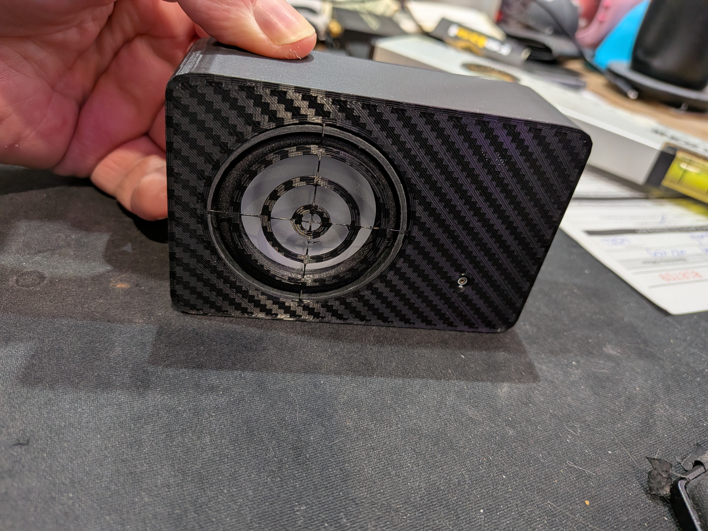
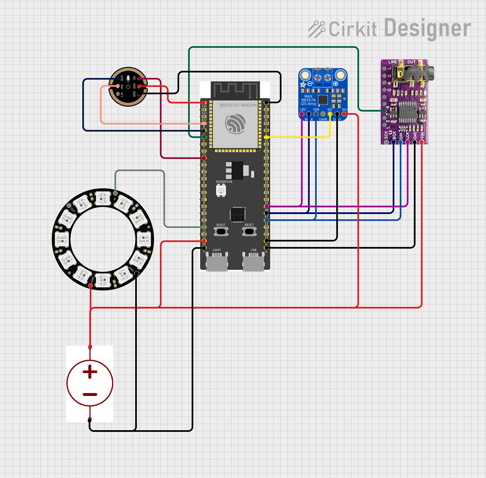

# HA-Smart-Pucks
Home Assistant Smart Speakers based on ESP32s running ESPhome

<h2>Very much early stage. Use at own risk.</h2>

Smart Puck - HA Voice Assistant
* ESP32 S3 N16R8 / N8R2
* MAX98357A Class D Amplifier
* INMP441 Omnidirection Mic
* 5V WS2812 24LED ring (outer diameter 72mm)
* 2" 4 Ohm 3W speaker

Smart Speaker Box - HA Voice Assistant + SendSpin endpoint
* ESP32 S3 N16R8 
* MAX98357A Class D Amplifier
* INMP441 Omnidirection Mic
* 5V WS2812 8LED ring (outer diameter 27mm)
* 2" 4 Ohm 3W speaker
* PCM5102A DAC

Smart Puck

Smart Speaker Box

Wiring Diagram for the Puck

Wiring Diagram for the Box

